# MessageAI - Architecture Diagrams

## System Architecture Overview

```mermaid
graph TB
    subgraph "CLIENT - React Native App"
        subgraph "UI Layer"
            A1[Existing Screens<br/>Chat/Conversations/Profile]
            A2[AI Chat Screen<br/>NEW]
            A3[AI Pop-up Components<br/>NEW]
        end

        subgraph "State Management"
            B1[Zustand Stores<br/>auth/chat/ui EXISTING]
            B2[AI Store<br/>NEW]
        end

        subgraph "Service Layer"
            C1[Auth Service<br/>EXISTING]
            C2[Chat Service<br/>EXISTING]
            C3[Calendar Service<br/>NEW]
            C4[AI Service<br/>NEW]
        end

        A1 --> B1
        A2 --> B2
        A3 --> B2
        B1 --> C1
        B1 --> C2
        B2 --> C3
        B2 --> C4
    end

    subgraph "FIREBASE Backend - EXISTING"
        subgraph "Authentication"
            D1[Firebase Auth<br/>Email/Password]
        end

        subgraph "Database - Firestore"
            E1[users Collection<br/>EXISTING]
            E2[conversations Collection<br/>EXISTING]
            E3[messages Subcollection<br/>EXISTING]
            E4[ai_conversations<br/>NEW]
            E5[ai_suggestions<br/>NEW]
            E6[ai_preferences<br/>NEW]
            E7[calendar_tokens<br/>NEW - ENCRYPTED]
        end

        subgraph "Cloud Functions"
            F1[onMessageCreated<br/>EXISTING]
            F2[analyzeMessage<br/>NEW - OPTIONAL]
        end
    end

    subgraph "AWS Lambda - NEW"
        subgraph "AI Service Endpoints"
            G1[POST /ai/chat<br/>Conversational Interface]
            G2[POST /ai/extract-event<br/>Event Extraction]
            G3[POST /ai/detect-conflicts<br/>Conflict Detection]
            G4[GET /health<br/>Health Check]
        end

        subgraph "AI Logic"
            H1[Message Parser]
            H2[Event Extractor]
            H3[Conflict Detector]
            H4[Response Generator]
        end

        G1 --> H1
        G2 --> H2
        G3 --> H3
        G1 --> H4
    end

    subgraph "External APIs"
        I1[OpenAI API<br/>GPT-4 / GPT-4o-mini<br/>Function Calling]
        I2[Google Calendar API<br/>OAuth 2.0<br/>Events CRUD]
    end

    %% Client to Firebase
    C1 --> D1
    C2 --> E2
    C2 --> E3
    C4 --> E4
    C4 --> E5
    C3 --> E7

    %% Client to AWS Lambda
    C4 -.HTTPS.-> G1
    C4 -.HTTPS.-> G2
    C4 -.HTTPS.-> G3

    %% AWS Lambda to OpenAI
    H1 -.Function Calling.-> I1
    H2 -.Function Calling.-> I1
    H3 -.Function Calling.-> I1
    H4 -.Function Calling.-> I1

    %% AWS Lambda to Google Calendar
    H2 -.OAuth 2.0.-> I2
    H3 -.OAuth 2.0.-> I2

    %% Firebase Cloud Functions
    E3 --> F1
    F1 -.Optional.-> F2
    F2 -.Call Lambda.-> G2

    %% Calendar Service to Google
    C3 -.OAuth 2.0.-> I2

    %% Styling
    classDef existing fill:#90EE90,stroke:#228B22,stroke-width:2px,color:#000
    classDef new fill:#87CEEB,stroke:#4682B4,stroke-width:2px,color:#000
    classDef external fill:#FFB6C1,stroke:#C71585,stroke-width:2px,color:#000
    classDef security fill:#FFD700,stroke:#FF8C00,stroke-width:3px,color:#000

    class A1,B1,C1,C2,D1,E1,E2,E3,F1 existing
    class A2,A3,B2,C3,C4,E4,E5,E6,E7,F2,G1,G2,G3,G4,H1,H2,H3,H4 new
    class I1,I2 external
    class E7 security
```

### Architecture Legend

**Colors:**

- 🟢 **Green** - Existing components (from MVP messaging app)
- 🔵 **Blue** - New components (AI features)
- 🌸 **Pink** - External APIs (OpenAI, Google Calendar)
- 🟡 **Gold** - Security-critical (encrypted tokens)

**Line Types:**

- **Solid arrows** (→) - Direct data flow / synchronous calls
- **Dotted arrows** (-..->) - Async API calls / external services

**Key Architectural Decisions:**

1. **Separation of Concerns:** AI service in separate AWS Lambda (not in Firebase)
2. **Security First:** Calendar tokens encrypted in Firestore
3. **Scalability:** AWS Lambda auto-scales independently from Firebase
4. **Cost Optimization:** Direct client → Lambda calls (bypass Firebase for AI)
5. **Flexibility:** Can swap OpenAI for alternative LLM without client changes

---

## AI Chat Flow


### Flow Breakdown

**Step 1: User Input (50ms)**

- User types query in AI Chat screen
- Input validated (not empty, <5000 chars)
- Message added to UI optimistically

**Step 2: API Call (100ms)**

- Service layer calls AWS Lambda endpoint
- Includes user ID, message, last 10 conversation turns
- Auth token verified

**Step 3: AI Processing (1-2s)**

- Lambda parses query intent
- OpenAI determines which tool to call
- `getCalendarEvents` function invoked
- Calendar API fetched (500ms)
- OpenAI formats response (500ms)

**Step 4: Response Display (100ms)**

- Lambda returns structured response
- UI updates with AI message
- Shows events in formatted list
- Displays AI reasoning (collapsible)

**Step 5: Persistence (200ms, async)**

- Conversation turn saved to Firestore
- Metadata updated (toolsCalled, eventsQueried)
- Does not block user experience

**Total Latency:** ~2-3 seconds (well under 3s target)

---

## Conflict Detection Flow

```mermaid
sequenceDiagram
    actor User
    participant App as React Native App
    participant Message as Message Bubble
    participant Modal as Conflict Modal
    participant Service as AI Service
    participant Lambda as AWS Lambda
    participant OpenAI as OpenAI GPT-4
    participant GCal as Google Calendar API
    participant Firestore as Firestore

    User->>App: Receives message: "Soccer Saturday 3PM"
    App->>Message: Render message bubble

    User->>Message: Long press → "Analyze with AI"
    Message->>Service: extractEvent(messageText)

    Service->>Lambda: POST /ai/extract-event
    Lambda->>OpenAI: Extract event from text
    OpenAI-->>Lambda: {title:"Soccer", date:"2025-10-25", time:"15:00"}

    Note over Lambda: Check for conflicts
    Lambda->>GCal: GET events for 2025-10-25
    GCal-->>Lambda: [{title:"Eva's party", start:"14:00", end:"17:00"}]

    Note over Lambda: Calculate overlap
    Lambda->>Lambda: Conflict detected: 2 hours overlap

    Lambda-->>Service: {hasEvent:true, conflicts:[...]}
    Service-->>Message: Update with AI badge
    Message->>Firestore: Save AI suggestion

    Message-->>App: Show ⚠️ conflict badge

    User->>Message: Tap conflict badge
    Message->>Modal: Open conflict modal
    Modal-->>User: Display conflict details

    alt User: "View Calendar"
        Modal->>App: Deep link to Calendar app
        App-->>User: Opens native calendar
    else User: "Book Anyway"
        Modal->>Service: createEvent(event)
        Service->>Lambda: POST to calendar
        Lambda->>GCal: Create event (despite conflict)
        GCal-->>Lambda: Event created ✓
        Lambda-->>Service: Success
        Service->>Firestore: Log user action (manual override)
        Service-->>Modal: Event created
        Modal-->>User: Toast: "✓ Event added"
    else User: "Dismiss"
        Modal->>Firestore: Log user action (dismissed)
        Modal-->>User: Close modal
    end

    Note over User,Firestore: Detection time: <2 seconds
```



### Flow Breakdown

**Step 1: Trigger Analysis (User-Initiated)**

- User long-presses message bubble
- Action sheet appears: [Reply, Copy, **Analyze with AI**, Delete]
- User selects "Analyze with AI"

**Step 2: Event Extraction (1-1.5s)**

- Message text sent to Lambda
- OpenAI extracts structured event data
- Confidence score calculated (0-1)
- If confidence <0.7, asks for clarification

**Step 3: Conflict Detection (500ms)**

- Lambda queries Google Calendar for that date
- Calculates time overlap for all events
- Classifies severity: high (>60min), medium (30-60min), low (<30min)

**Step 4: UI Update (100ms)**

- AI suggestion stored in Firestore
- Message bubble shows badge (⚠️ or 📅)
- Badge color indicates conflict severity

**Step 5: User Decision**

- User taps badge → Modal opens
- Shows proposed event vs conflicting events
- Three actions available:
  - **View Calendar:** Opens native app
  - **Book Anyway:** Creates despite conflict
  - **Dismiss:** Closes modal, no action

**Total Latency:** <2 seconds (meets target)

---

## Event Creation Flow

```mermaid
sequenceDiagram
    actor User
    participant App as AI Chat Screen
    participant Service as AI Service
    participant Lambda as AWS Lambda
    participant OpenAI as OpenAI GPT-4
    participant GCal as Google Calendar API
    participant Firestore as Firestore

    User->>App: "Book Saturday 3PM for family time"
    App->>Service: sendMessage(query)
    Service->>Lambda: POST /ai/chat

    Lambda->>OpenAI: Parse intent & extract event
    OpenAI-->>Lambda: Intent: CREATE_EVENT<br/>{title:"family time", date:"2025-10-25", time:"15:00"}

    Note over Lambda: Check conflicts first
    Lambda->>Lambda: Call detectConflicts tool
    Lambda->>GCal: GET events for Saturday
    GCal-->>Lambda: [{title:"Eva's party", start:"14:00", end:"17:00"}]

    Lambda->>Lambda: Conflict detected!

    Lambda->>OpenAI: Format response with conflict info
    OpenAI-->>Lambda: "I found a conflict with Eva's party (2-5PM)..."

    Lambda-->>Service: {reply, needsConfirmation:true, conflicts:[...]}
    Service-->>App: Display AI response

    App-->>User: "⚠️ Conflict detected with Eva's party.<br/>Do you want to book it anyway?"<br/>[Yes] [No, suggest other times]

    alt User: "Yes, book it anyway"
        User->>App: Tap [Yes]
        App->>Service: confirmEventCreation(event)
        Service->>Lambda: POST /ai/chat (confirmation)

        Lambda->>OpenAI: Function call: createCalendarEvent
        Lambda->>GCal: POST /calendars/primary/events
        GCal-->>Lambda: Event created (ID: abc123)

        Lambda->>OpenAI: Format success message
        OpenAI-->>Lambda: "✓ Added 'Family time' to Saturday 3PM"

        Lambda-->>Service: {reply, eventCreated:true}
        Service->>Firestore: Save conversation + log event creation
        Service-->>App: Update UI
        App-->>User: "✓ Event added to your calendar!"

    else User: "Suggest other times"
        User->>App: Tap [No, suggest other times]
        App->>Service: sendMessage("suggest other times")
        Service->>Lambda: POST /ai/chat

        Lambda->>GCal: GET events for Sat-Sun
        GCal-->>Lambda: Full weekend schedule

        Lambda->>Lambda: Calculate free slots (≥1 hour)
        Lambda->>OpenAI: Format suggestions
        OpenAI-->>Lambda: "You're free: Sat 11AM-2PM, Sat 6PM-9PM..."

        Lambda-->>Service: {reply, alternativeTimes:[...]}
        Service-->>App: Display suggestions
        App-->>User: Shows available time slots

        Note over User,App: User can select a time<br/>and flow repeats
    end
```



### Flow Breakdown

**Step 1: Intent Recognition (500ms)**

- User types natural language request
- Lambda sends to OpenAI for parsing
- Intent classified: CREATE_EVENT, QUERY_SCHEDULE, FIND_TIME, etc.
- Structured event data extracted

**Step 2: Proactive Conflict Check (500ms)**

- Before confirming, AI checks calendar
- Retrieves events for proposed date/time
- Calculates overlaps
- If conflict found → Proceed to Step 3
- If no conflict → Skip to Step 4

**Step 3: User Confirmation (User-paced)**

- AI explains conflict clearly
- Offers choices: Book anyway / Suggest alternatives
- User makes decision
- No timeout (waits for user)

**Step 4: Event Creation (500ms)**

- AI calls Google Calendar API
- Event created with all details
- Returns event ID for reference
- Logs action in Firestore

**Step 5: Success Feedback (100ms)**

- AI confirms with natural language
- Shows event details
- User can verify in calendar app
- Option to undo (future feature)

**Key Design Decisions:**

1. **Always check conflicts first** - Prevents accidental double-booking
2. **User always confirms** - No silent auto-scheduling
3. **Offer alternatives** - Don't just say "no", suggest solutions
4. **Clear feedback** - User knows exactly what happened

---

## Data Model Relationships


### Collection Paths

```
Firestore Structure:

/users/{userId}
├── (existing user fields)
├── /ai_conversations/{conversationId}
│   └── turns: Array<ConversationTurn>
├── /tokens
│   └── google: CalendarTokens (ENCRYPTED)
└── /ai_preferences: AIPreferences

/conversations/{conversationId}
├── (existing conversation fields)
└── /messages/{messageId}
    ├── (existing message fields)
    ├── hasAISuggestion: boolean
    └── /ai_suggestions/{suggestionId}
        └── (suggestion data)

/ai_feedback/{feedbackId}
└── (global feedback data)
```

### Data Access Patterns

**Pattern 1: Load AI Chat**

```
Query: users/{userId}/ai_conversations
Order by: updatedAt DESC
Limit: 1 (most recent conversation)
→ Load last 10 turns for context
```

**Pattern 2: Check for AI Suggestions**

```
Query: conversations/{convId}/messages/{msgId}/ai_suggestions
Where: userAction == null (pending actions)
→ Show badge if suggestions exist
```

**Pattern 3: User Preferences**

```
Query: users/{userId}/ai_preferences
→ Single document read
→ Cache locally for session
```

**Pattern 4: Calendar Token Retrieval**

```
Query: users/{userId}/tokens/google
→ Single document read
→ Decrypt tokens
→ Check expiry, refresh if needed
```

---

## Security Architecture


### Security Layers

**Layer 1: Client Authentication**

- Firebase Auth JWT token for all requests
- Token included in Authorization header
- Automatic refresh before expiry
- Secure storage in iOS Keychain

**Layer 2: Network Transport**

- All traffic over HTTPS/TLS 1.3
- Certificate validation
- No sensitive data in URLs (use POST body)
- Request/response encryption

**Layer 3: API Gateway**

- API key required for all Lambda endpoints
- Rate limiting: 30 req/min per user, 1000 req/hour per IP
- CORS policy: Only allow app origin
- Request size limits (5MB max)

**Layer 4: Lambda Authorization**

- Verify Firebase Auth token using Admin SDK
- Extract user ID from verified token
- Ensure user can only access their own data
- Input validation and sanitization

**Layer 5: Data Protection**

- Firestore Security Rules enforce ownership
- Calendar tokens encrypted with AES-256
- Encryption keys in AWS Secrets Manager
- Audit logs for all data access

**Layer 6: External APIs**

- OAuth 2.0 for Google Calendar (industry standard)
- OpenAI API key never exposed to client
- Automatic token refresh before expiry
- Revocation handling

### Threat Mitigation

**Threat: Unauthorized Calendar Access**

- Mitigation: OAuth tokens encrypted at rest
- Mitigation: User can revoke access anytime
- Mitigation: Token scopes limited to necessary permissions

**Threat: API Key Exposure**

- Mitigation: Keys stored in AWS Secrets Manager
- Mitigation: Never logged or exposed in errors
- Mitigation: Automatic rotation (quarterly)

**Threat: Injection Attacks**

- Mitigation: Input sanitization on all user input
- Mitigation: Parameterized OpenAI prompts (no string interpolation)
- Mitigation: Firestore queries use safe methods

**Threat: DDoS / Abuse**

- Mitigation: Rate limiting per user and IP
- Mitigation: Budget caps to prevent cost attacks
- Mitigation: CloudWatch alerts for anomalies

**Threat: Data Leakage**

- Mitigation: Firestore rules enforce user-based access
- Mitigation: Lambda verifies user owns requested data
- Mitigation: No cross-user data exposure

**Threat: Man-in-the-Middle**

- Mitigation: TLS 1.3 encryption
- Mitigation: Certificate validation
- Mitigation: Future: Certificate pinning

---

## Performance Optimization


### Performance Targets

| Metric             | Target | Current | Status |
| ------------------ | ------ | ------- | ------ |
| AI Chat Response   | <3s    | TBD     | 🟡     |
| Conflict Detection | <2s    | TBD     | 🟡     |
| Event Creation     | <1s    | TBD     | 🟡     |
| Lambda Cold Start  | <500ms | TBD     | 🟡     |
| Calendar API Call  | <300ms | TBD     | 🟡     |
| OpenAI API Call    | <2s    | TBD     | 🟡     |

### Optimization Strategies

**Client-Side:**

- Cache conversation history (last 50 messages)
- Cache user preferences (session lifetime)
- Optimistic UI for event creation
- Debounce AI chat input (500ms)

**Lambda:**

- Provisioned concurrency: 10 instances (eliminate cold starts)
- In-memory cache for calendar events (5 min TTL)
- Connection pooling for Firestore
- Async logging (don't block response)

**AI Service:**

- Use GPT-4o-mini for simple tasks (10x cheaper, 2x faster)
- Cache similar queries (hash-based, 60 min TTL)
- Optimize prompts (reduce token count by 30%)
- Batch multiple tool calls when possible

**Google Calendar:**

- Batch fetch events (fetch full day, not individual)
- Cache events aggressively (invalidate on write)
- Use ETags for conditional requests (304 Not Modified)
- Incremental sync (only fetch changes since last sync)

---

## Deployment Architecture


### Deployment Strategy

**Phase 0: Development Environment**

1. Local Firebase Emulator for Firestore testing
2. AWS SAM Local for Lambda development
3. Mock OpenAI responses (save costs)
4. Mock Google Calendar API

**Phase 1-3: Staging Environment**

1. Deploy to Firebase staging project
2. Deploy Lambda to AWS staging
3. Use real OpenAI API (with budget limits)
4. Use real Google Calendar API (test accounts)
5. Invite 5-10 beta testers

**Production: Production Environment**

1. Deploy to Firebase production project
2. Deploy Lambda to AWS production (with provisioned concurrency)
3. Set up CloudWatch monitoring and alarms
4. Configure error tracking (Sentry/Crashlytics)
5. Gradual rollout: 10% → 50% → 100%

---

## Monitoring & Observability


### Key Dashboards

**1. Real-Time Operations Dashboard**

- Current Lambda invocations/minute
- OpenAI API response times
- Error rate (last 5 minutes)
- Active users with AI features

**2. Cost Dashboard**

- Daily spend vs budget
- Cost per user
- Most expensive operations
- Projection for month-end

**3. User Experience Dashboard**

- Average response times
- Feature adoption rates
- User satisfaction scores
- Most common queries

**4. Health Dashboard**

- System status (all green/yellow/red)
- API availability (OpenAI, Google)
- Error logs (last 100)
- Alerts (active/resolved)

---

## Future Architecture Enhancements


**Not in Current Scope, But Designed For:**

- Support for multiple LLM providers
- On-device processing for privacy
- Real-time streaming responses
- Geographic distribution
- Sophisticated experimentation framework
- Advanced analytics pipeline
